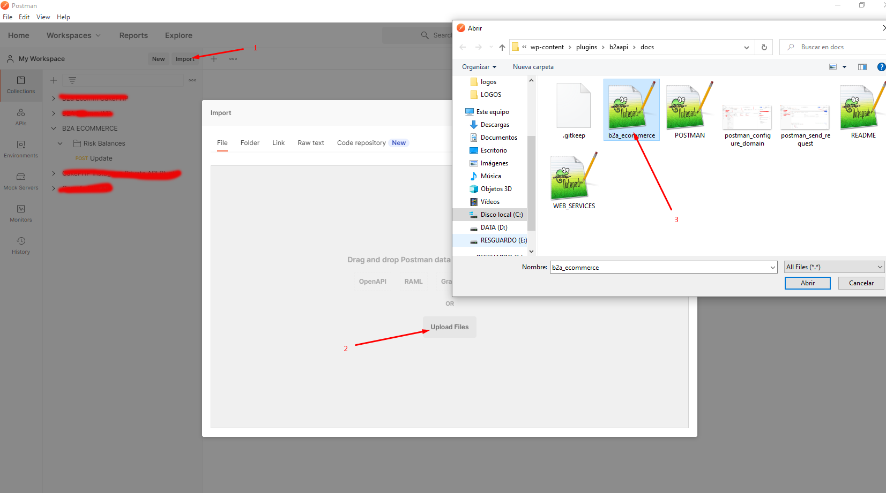
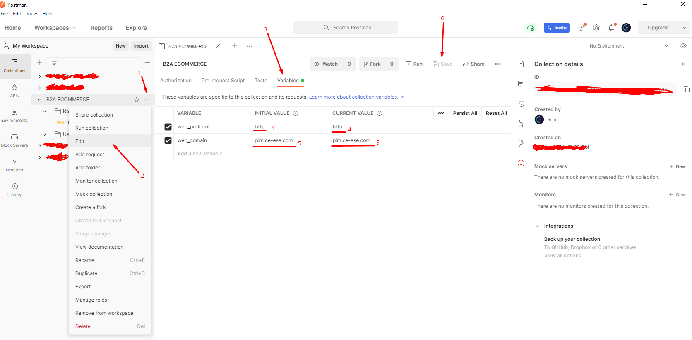
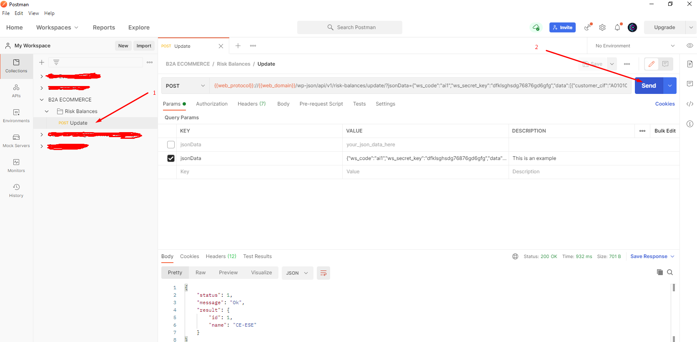

# Servicio Web de actualización de riesgos de clientes

## Postman

Puedes utilizar Postman para realizar pruebas de utilización de este servicio web.

### Requisitos

- Instalar [Postman](https://www.postman.com/).

- Descargar el [archivo de configuracion](postman/b2a_ecommerce.json).

### Instrucciones

- Importar archivo de configuración

- Configura el dominio

- Enviar la petición

